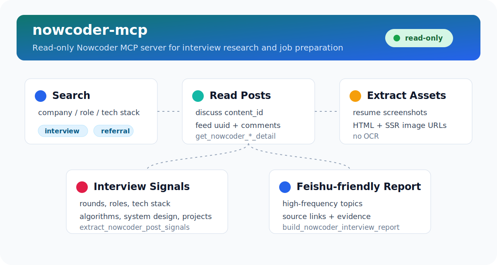

# nowcoder-mcp

[](https://www.python.org/)
[](https://modelcontextprotocol.io/)
[](https://docs.astral.sh/uv/)
[](#安全边界)

`nowcoder-mcp` 是一个只读的牛客（Nowcoder）MCP 服务，把牛客公开搜索、帖子详情、评论、图片资源提取和面经分析能力接入 Hermes Agent、Claude Desktop、Cursor、Cherry Studio 等 MCP 客户端。

它适合做求职调研和面试准备：搜索某公司/岗位面经，读取 discuss 或 Feed 正文，提取简历锐评帖里的图片资源 URL，汇总高频面试主题，并生成适合飞书阅读的 Markdown 面试准备报告。



## 能力预览

- **公开内容搜索**：按关键词搜索牛客公开内容，支持面经、求职进度、内推、公司评价和全部内容过滤。
- **批量调研**：一次搜索多个公司、岗位或技术关键词，适合横向比较面试信息。
- **帖子详情读取**：支持 `content_id` 读取 discuss 文章，支持 `uuid` 读取 Feed 动态。
- **评论和用户信息**：读取 discuss 可见评论，获取公开用户主页元信息。
- **图片资源提取**：从 discuss 正文 HTML 和 Feed SSR 字段中提取图片 URL，不做 OCR。
- **面试信号抽取**：从单篇帖子中抽取轮次、岗位、技术栈、算法、系统设计、项目深挖、流程和结果等结构化信号。
- **高频主题分析**：从搜索结果中聚合高频面试主题，并保留来源链接和证据片段。
- **面试准备报告**：生成适合飞书、Markdown 文档和 Agent 回复使用的面试准备报告。
- **可选登录态**：默认匿名模式；也支持 Playwright storage state 或微信扫码登录复用登录态。
- **安全登录检查**：登录相关工具只返回状态，不输出 cookie、header 或 storage state。

## 快速开始

项目使用 `uv` 和 Python 3.12+。

```bash
git clone https://github.com/icatw/nowcoder-mcp.git
cd nowcoder-mcp
uv sync --dev
uv run nowcoder-mcp serve
```

单独启动 `serve` 会通过 stdio 运行 MCP 服务，通常由 MCP 客户端拉起，不需要长期手动运行。

## 在 MCP 客户端中使用

### Hermes Agent

```yaml
mcp_servers:
  nowcoder:
    command: uv
    args:
      - --directory
      - /absolute/path/to/nowcoder-mcp
      - run
      - nowcoder-mcp
      - serve
    env:
      NOWCODER_AUTH_MODE: anonymous
```

配置后重启或重载 Hermes，并验证工具发现：

```bash
hermes mcp test nowcoder
```

当前预期能发现 17 个工具。

### Claude Desktop / Cherry Studio / Cursor

大多数 MCP 客户端都支持类似的 stdio 配置。把路径替换成你的本地仓库绝对路径：

```json
{
  "mcpServers": {
    "nowcoder": {
      "command": "uv",
      "args": [
        "--directory",
        "/absolute/path/to/nowcoder-mcp",
        "run",
        "nowcoder-mcp",
        "serve"
      ],
      "env": {
        "NOWCODER_AUTH_MODE": "anonymous"
      }
    }
  }
}
```

如果客户端不继承 shell 环境，建议使用 `uv` 的绝对路径，例如 `/home/you/.local/bin/uv`。

## 典型用法

在 Agent 里可以直接用自然语言调用工具，例如：

- `帮我搜一下字节跳动 Java 后端面经，按高频问题整理准备清单`
- `读取这个牛客 discuss 帖子 877151327091027968，总结面试轮次和技术点`
- `找 2026 届 AI Agent 开发相关面经，提取项目深挖问题`
- `这个 Feed uuid 里有没有简历截图，帮我提取图片链接`

也可以用 CLI 做 smoke test 和调试。

### 搜索内容

```bash
uv run nowcoder-mcp smoke-search "字节跳动 Java 面经" --max-pages 1
uv run nowcoder-mcp smoke-search "AI Agent 开发 面经" --tag all --sort relevance
```

真实输出结构示例：

```json
{
  "query": "字节跳动 Java 面经",
  "tag": "interview",
  "sort": "latest",
  "total": 233,
  "total_pages": 12,
  "records": [
    {
      "title": "Agent 开发面经总结【04/24】阿里巴巴 / 蚂蚁 / 字节跳动  总结",
      "rc_type": 207,
      "content_id": "877151327091027968",
      "uuid": null,
      "view_count": 1328,
      "like_count": 4,
      "comment_count": 0,
      "url": "https://www.nowcoder.com/discuss/877151327091027968"
    }
  ]
}
```

### 读取评论和用户信息

```bash
uv run nowcoder-mcp smoke-comments 877151327091027968
uv run nowcoder-mcp smoke-user <user_id>
```

### 抽取面试信号和主题

```bash
uv run nowcoder-mcp smoke-signals --content-id <content_id>
uv run nowcoder-mcp smoke-signals --uuid <feed_uuid>
uv run nowcoder-mcp smoke-topics "字节跳动 Java 面经" --max-posts 3
uv run nowcoder-mcp smoke-report "字节跳动 Java 面经" --max-posts 3 --markdown-only
```

报告输出是 Markdown，适合直接贴到飞书或交给 Agent 继续改写。

### 提取图片资源

```bash
uv run nowcoder-mcp smoke-assets --content-id <content_id>
uv run nowcoder-mcp smoke-assets --uuid <feed_uuid>
```

返回示例：

```json
{
  "source_type": "feed",
  "source_id": "7cc65b74b053461893959f09b244765f",
  "title": "嵌入式三本秋招简历，求锐评",
  "url": "https://www.nowcoder.com/feed/main/detail/7cc65b74b053461893959f09b244765f",
  "images": [
    {
      "url": "https://uploadfiles.nowcoder.com/images/20251208/326127462_1765178274313/72E29057FF33329991E31137D4A1F8C7",
      "alt": "屏幕截图 2025-12-08 151739.png",
      "source": "imgMoment"
    }
  ]
}
```

图片提取器支持 discuss 正文 HTML 图片，也支持 Feed SSR 字段，例如 `imgMoment`、`contentImageUrls`。牛客上传图片有时没有 `.jpg` 或 `.png` 后缀，也会被正常识别。

## MCP 工具

**搜索与发现**

- `search_nowcoder(query, tag="interview", sort="latest", max_pages=1, use_auth=false)`
- `batch_search_nowcoder(queries, tag="all", sort="latest", max_pages=1, use_auth=false)`
- `search_nowcoder_interviews(company=None, role=None, tech_stack=None, year=None, max_pages=2)`

**内容读取**

- `get_nowcoder_discuss_detail(content_id, use_auth=false)`
- `get_nowcoder_feed_detail(uuid, use_auth=false)`
- `get_nowcoder_discuss_comments(content_id, page=1, use_auth=false)`
- `get_nowcoder_user_public_profile(user_id, use_auth=false)`
- `get_nowcoder_post_assets(content_id=None, uuid=None, use_auth=false)`

**面试分析**

- `extract_nowcoder_post_signals(content_id=None, uuid=None, use_auth=false)`
- `analyze_nowcoder_interview_topics(query, max_pages=1, max_posts=5, use_auth=false)`
- `build_nowcoder_interview_report(query, max_pages=1, max_posts=5, use_auth=false)`

**登录态**

- `nowcoder_auth_status()`
- `nowcoder_auth_probe()`
- `nowcoder_me()`
- `nowcoder_wechat_login_qr_code(save_image=false)`
- `nowcoder_wechat_login_status(ticket, callback=None)`
- `nowcoder_wechat_login_wait(ticket, callback=None, timeout_seconds=120, interval_seconds=3.0)`

## 登录态

匿名模式是默认模式。对于牛客公开暴露的数据，匿名模式通常足够完成搜索、详情读取、评论读取和图片资源提取。

```bash
uv run nowcoder-mcp auth status
```

如果需要登录态读取，可以用浏览器捕获 Playwright storage state：

```bash
uv run nowcoder-mcp auth login
NOWCODER_AUTH_MODE=playwright_state uv run nowcoder-mcp auth probe
NOWCODER_AUTH_MODE=playwright_state uv run nowcoder-mcp me
```

也可以使用微信扫码登录：

```bash
uv run nowcoder-mcp auth wechat-qr --save-image
uv run nowcoder-mcp auth wechat-status <ticket>
uv run nowcoder-mcp auth wechat-wait <ticket>
```

所有登录相关工具都不会输出原始 cookie、请求 header 或 storage state 内容。

## 环境变量

| 变量 | 默认值 | 说明 |
| --- | --- | --- |
| `NOWCODER_AUTH_MODE` | `anonymous` | 登录模式。可选 `anonymous`、`playwright_state`。 |
| `NOWCODER_AUTH_STATE` | `~/.config/nowcoder-mcp/storage_state.json` | Playwright storage state 保存路径。 |
| `NOWCODER_COOKIE_ENV` | `NOWCODER_COOKIE` | 自定义读取 cookie 的环境变量名。 |
| `NOWCODER_TIMEOUT_SECONDS` | `20` | 请求超时时间。 |
| `NOWCODER_RATE_LIMIT_PER_MINUTE` | 项目默认值 | 每分钟请求上限。 |
| `NOWCODER_CACHE_TTL_SECONDS` | 项目默认值 | 进程内缓存 TTL。 |
| `NOWCODER_MAX_PAGES_CAP` | 项目默认值 | 搜索分页上限，防止一次抓取过多页面。 |

## 安全边界

本项目保持只读，不提供发帖、评论、点赞、关注、私信、投递、修改个人资料等写操作。

本项目不做 OCR。图片提取只返回图片资源 URL，调用方可以按需要自行查看、下载或交给其他 OCR/视觉工具处理。

登录态文件只保存在本地，状态检查和 MCP 工具返回值会避免泄露 cookie、header 和 storage state。不要把本地登录态文件提交到 Git。

## 开发

```bash
uv sync --dev
uv run pytest -q
uv run ruff check .
uv run nowcoder-mcp --help
hermes mcp test nowcoder
```

开发时使用过的真实 smoke 示例：

```bash
uv run nowcoder-mcp smoke-assets --uuid 7cc65b74b053461893959f09b244765f
uv run nowcoder-mcp smoke-assets --content-id 900896686346694656
```

## 参考

README 结构参考了常见开源 MCP 项目的写法：先说明用途和使用场景，再给出快速开始、客户端配置、工具清单、安全边界和开发验证。相关项目包括 Model Context Protocol 官方 servers、GitHub MCP Server、Markdownify MCP Server 等。
